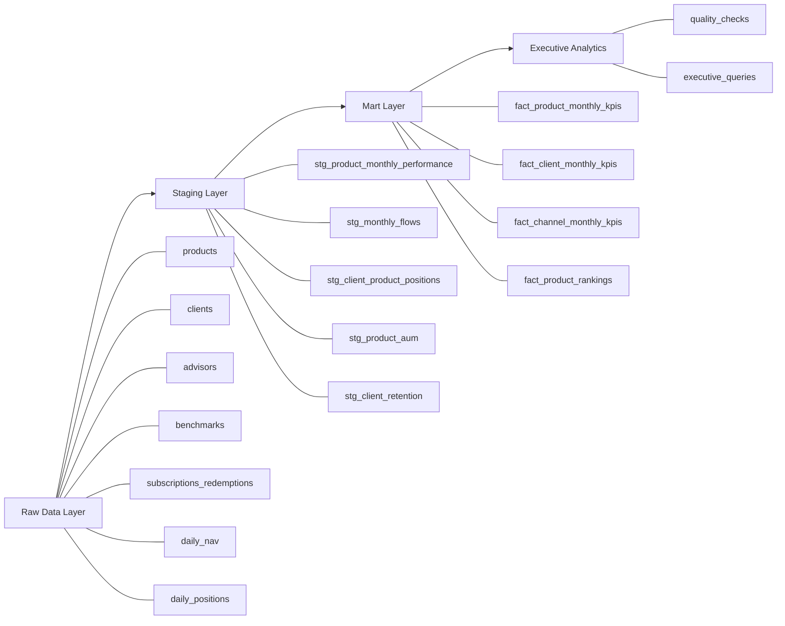

# Investment Product Intelligence Warehouse

A professional-grade SQL analytics project that models an institutional-style investment product intelligence warehouse in PostgreSQL. The platform is designed to help a financial product head evaluate product growth, flows, benchmark-relative performance, client retention, and channel economics across a multi-product investment platform.

## Business objective

This project simulates the analytics layer a financial institution could use to answer high-value product questions:

- Which investment products are driving AUM growth?
- Which products are winning or losing net flows?
- Which products are outperforming their benchmarks?
- Which channels and regions are commercially strongest?
- Which client segments are most stable and retainable?
- Where does commercial momentum diverge from investment performance?

The goal is not just to write SQL queries. The goal is to design a reusable product analytics warehouse that produces decision-ready outputs for leadership.

## Project architecture

The warehouse is organized into four layers:

- `raw`: source-style operational tables for products, clients, advisors, transactions, NAV, and positions.
- `staging`: cleaned and standardized transformation layer.
- `mart`: business-facing KPI tables for products, clients, and channels.
- `analytics`: quality-control outputs and validation checks.



## Data model

The warehouse includes these core entities:

### Raw layer
- `raw.products`
- `raw.clients`
- `raw.advisors`
- `raw.benchmarks`
- `raw.calendar`
- `raw.subscriptions_redemptions`
- `raw.daily_nav`
- `raw.daily_positions`

### Staging layer
- `staging.stg_product_monthly_performance`
- `staging.stg_monthly_flows`
- `staging.stg_client_product_positions`
- `staging.stg_product_aum`
- `staging.stg_client_retention`

### Mart layer
- `mart.fact_product_monthly_kpis`
- `mart.fact_client_monthly_kpis`
- `mart.fact_channel_monthly_kpis`
- `mart.fact_product_rankings`

### Analytics layer
- `analytics.quality_checks`

## KPI framework

This warehouse is built around product-management and executive metrics:

- Assets under management (`aum_usd`)
- Net flows, subscriptions, and redemptions
- Product return versus benchmark return
- Excess return
- Client count by product
- AUM growth month over month
- Active clients by channel and region
- Client retention rate by segment
- Product rankings by AUM, flows, and excess return

## SQL workflow

The project is organized into six SQL files:

1. `sql/01_schema.sql`  
   Creates schemas, raw tables, and constraints.

2. `sql/02_seed_data.sql`  
   Loads synthetic benchmark, product, client, advisor, transaction, NAV, and position data.

3. `sql/03_staging.sql`  
   Builds analysis-ready staging tables for monthly performance, flows, positions, AUM, and retention.

4. `sql/04_marts.sql`  
   Creates executive-facing KPI marts for products, clients, channels, and rankings.

5. `sql/05_quality_checks.sql`  
   Implements validation and control checks across raw and mart layers.

6. `sql/06_executive_queries.sql`  
   Produces presentation-ready analytical outputs for leadership review.

## Example executive questions answered

- What are the top five products by latest AUM?
- Which products generated the strongest recent net flows?
- Which products outperformed their benchmarks?
- Which channels have the highest AUM concentration?
- Which client segments show the strongest retention?
- Which products have positive performance but negative flows?
- Which products are gathering flows despite negative excess return?

## Local setup

### 1. Create the database
```bash
createdb investment_product_intelligence
```

### 2. Run the build files
```bash
psql -d investment_product_intelligence -f sql/01_schema.sql
psql -d investment_product_intelligence -f sql/02_seed_data.sql
psql -d investment_product_intelligence -f sql/03_staging.sql
psql -d investment_product_intelligence -f sql/04_marts.sql
psql -d investment_product_intelligence -f sql/05_quality_checks.sql
psql -d investment_product_intelligence -f sql/06_executive_queries.sql
```

## Repository structure

```text
investment-product-intelligence-warehouse/
├── README.md
├── architecture/
├── data/
├── docs/
├── sql/
│   ├── 01_schema.sql
│   ├── 02_seed_data.sql
│   ├── 03_staging.sql
│   ├── 04_marts.sql
│   ├── 05_quality_checks.sql
│   └── 06_executive_queries.sql
└── dashboard/
    └── screenshots/
```

## Key design choices

- PostgreSQL was used as the core warehouse engine.
- The project uses a layered warehouse structure instead of flat one-off queries.
- Synthetic data was used to keep the project portfolio-safe and publicly shareable.
- Window functions were used for rankings, prior-period comparison, and retention logic.
- Quality checks were included to make the analytics outputs more trustworthy.

## Presentation value

This project is designed to demonstrate:
- SQL engineering fundamentals
- Warehouse design thinking
- Product analytics reasoning
- Financial metrics fluency
- Executive-facing communication

It is intended to be credible in conversations with hiring managers, product leaders, analytics teams, and finance stakeholders.

## Notes

This project uses synthetic data for demonstration purposes only. It does not represent real client accounts, investment performance, or production financial records.

## Screenshots

### Executive query output


### Quality checks output


### Warehouse build verification

