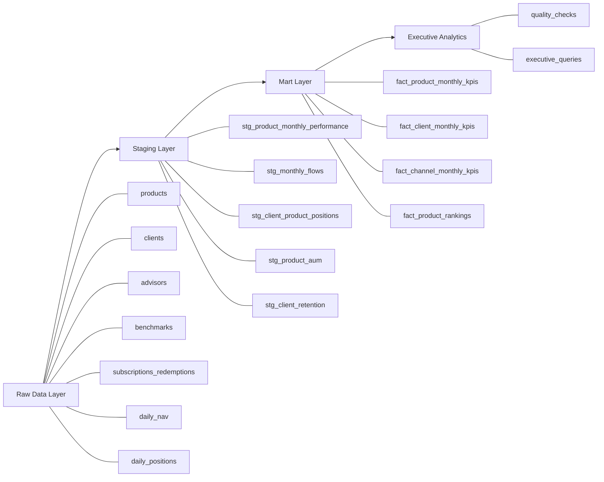

# Investment Product Intelligence Warehouse

A professional-grade SQL analytics project that models an institutional-style investment product intelligence warehouse in PostgreSQL. It is designed to help a financial product leader evaluate AUM growth, net flows, benchmark-relative performance, client retention, and channel economics across a multi-product platform.

## Project overview

This warehouse simulates the analytics layer a financial institution could use to answer high-value product questions:

- Which investment products are driving AUM growth?
- Which products are winning or losing net flows?
- Which products are outperforming their benchmarks?
- Which channels and regions are commercially strongest?
- Which client segments are most stable and retainable?
- Where does commercial momentum diverge from investment performance?

The goal is not just to write SQL queries. The goal is to design a reusable product analytics warehouse that produces decision-ready outputs for leadership.

## Architecture

The warehouse is organized into four layers:

- `raw`: Source-style operational tables for products, clients, advisors, transactions, NAV, and positions.
- `staging`: Cleaned and standardized transformation layer.
- `mart`: Business-facing KPI tables for products, clients, and channels.
- `analytics`: Quality-control outputs and executive validation queries.

## Repository structure

The repository currently uses a flat structure in the project root:

- `01_schema.sql`
- `02_seed_data.sql`
- `03_staging.sql`
- `04_marts.sql`
- `05_quality_checks.sql`
- `06_executive_queries.sql`
- `business-case.md`
- `findings.md`

This structure keeps the workflow simple and makes it easy to run the project step by step.

## Workflow

Run the SQL files in this order:

1. `01_schema.sql`
2. `02_seed_data.sql`
3. `03_staging.sql`
4. `04_marts.sql`
5. `05_quality_checks.sql`
6. `06_executive_queries.sql`

That sequence builds the warehouse, validates model quality, and produces executive-facing outputs.

## Screenshots

### Executive query output

### Quality checks output

### Warehouse build verification

## Why this project matters

This project demonstrates more than SQL syntax. It shows how to structure a finance-focused analytics system, create reusable marts, validate data quality, and translate raw operational data into business-facing insights.

That makes it useful as both a technical portfolio project and an example of product analytics thinking in an institutional investment context.
