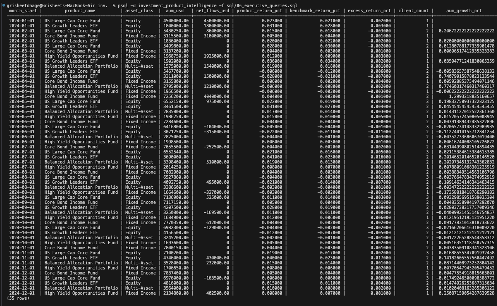
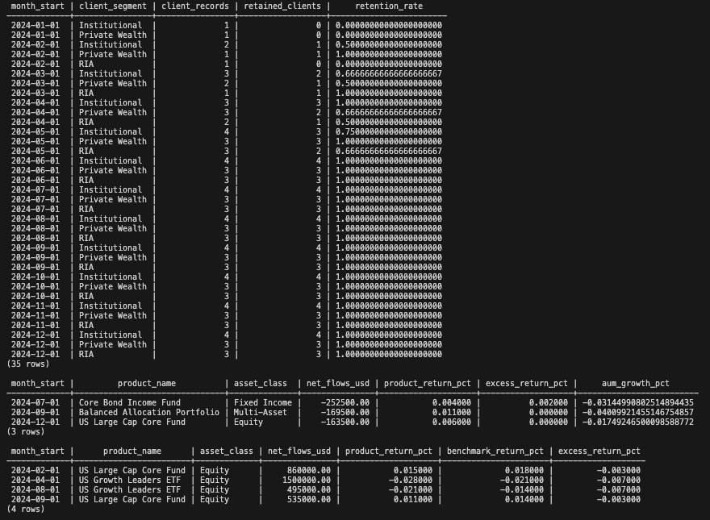
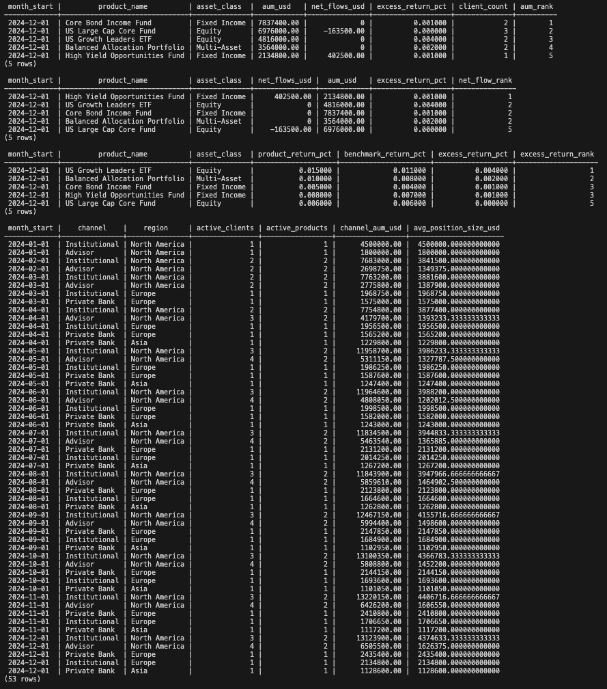

# Investment Product Intelligence Warehouse

> A production-style PostgreSQL analytics warehouse that gives a financial product organization a single, decision-ready view of AUM growth, net flows, benchmark-relative performance, client retention, and channel economics — built the way institutional analytics teams actually build it.

[](https://grisheet.github.io/investment-product-intelligence-warehouse/)
[](https://www.postgresql.org/)
[](LICENSE)

---

## The Business Problem

A financial product organization managing a multi-product investment platform cannot make confident product decisions using siloed reports. It needs a unified analytics layer that simultaneously answers:

| Business Question | Data Domain |
|---|---|
| Which products are growing AUM fastest? | Product × Transaction × NAV |
| Where is new money flowing — and where is it leaving? | Net Flows by Product & Channel |
| Which products are actually earning their benchmark? | Excess Return vs. Benchmark |
| Which client segments are most stable and retainable? | Client Retention & Churn Risk |
| Which distribution channels drive the most commercial value? | Channel & Regional Economics |
| Where does investment performance diverge from commercial momentum? | Cross-Domain Signal Correlation |

This warehouse is the infrastructure layer that makes those answers available on demand.

---

## Architecture

The warehouse follows a medallion architecture with four clearly separated schema layers:

```
raw  ──►  staging  ──►  mart  ──►  analytics
```

| Layer | Schema | Purpose |
|---|---|---|
| **Raw** | `raw` | Source-fidelity operational tables — products, clients, advisors, transactions, NAV, and daily positions. No transformations applied. |
| **Staging** | `staging` | Cleaned, standardized, and enriched views. Business logic applied once here, reused everywhere downstream. |
| **Mart** | `mart` | Denormalized, business-facing KPI fact tables. Optimized for analytical queries and executive reporting. |
| **Analytics** | `analytics` | Quality-control assertions and executive validation queries. Ensures model integrity before any output is trusted. |

### Data Model

```mermaid
flowchart LR
    subgraph RAW[" Raw Layer"]
        P[raw.products]
        C[raw.clients]
        A[raw.advisors]
        B[raw.benchmarks]
        SR[raw.subscriptions_redemptions]
        NAV[raw.daily_nav]
        DP[raw.daily_positions]
        CAL[raw.calendar]
    end

    subgraph STAGING[" Staging Layer"]
        SF[stg_monthly_flows]
        SP[stg_product_monthly_performance]
        SC[stg_client_positions]
    end

    subgraph MART[" Mart Layer"]
        FP[fact_product_monthly_kpis]
        FC[fact_client_monthly_kpis]
        FCH[fact_channel_monthly_kpis]
        FR[fact_product_rankings]
    end

    RAW --> STAGING
    STAGING --> MART
```



---

## Mart Tables — What Gets Produced

### `mart.fact_product_monthly_kpis`
Monthly product-level performance and flow summary. Joins AUM, transaction flows, NAV, and benchmark returns into a single grain per product per month.

**Key columns:** `product_id`, `product_name`, `asset_class`, `month_start`, `aum_usd`, `subscriptions_usd`, `redemptions_usd`, `net_flows_usd`, `nav_per_unit`, `product_return_pct`, `benchmark_return_pct`, `excess_return_pct`

### `mart.fact_client_monthly_kpis`
Client-level retention and AUM snapshot per month. Flags active vs. churned clients by region and distribution channel.

**Key columns:** `client_id`, `client_name`, `client_segment`, `region`, `channel`, `month_start`, `total_aum_usd`, `products_held`, `is_retained`

### `mart.fact_channel_monthly_kpis`
Channel and regional commercial summary. Tracks active client counts, product breadth, and AUM concentration by distribution channel.

**Key columns:** `channel`, `region`, `month_start`, `active_clients`, `active_products`, `channel_aum_usd`

### `mart.fact_product_rankings`
Product-level competitive ranking using SQL window functions. Ranks all products by AUM size, net flow strength, and benchmark-relative performance within each monthly period.

**Key columns:** `product_id`, `month_start`, `aum_rank`, `net_flow_rank`, `excess_return_rank`

---

## Repository Structure

```
investment-product-intelligence-warehouse/
├── 01_schema.sql              # Schema creation + all raw table definitions
├── 02_seed_data.sql           # Realistic seed data across all raw tables
├── 03_staging.sql             # Staging layer transformations
├── 04_marts.sql               # Mart layer KPI fact tables + ranking logic
├── 05_quality_checks.sql      # Data quality assertions and validation tests
├── 06_executive_queries.sql   # Executive-facing analytical outputs
├── business-case.md           # Institutional context and product rationale
├── findings.md                # Framework for interpreting executive outputs
└── README.md
```

---

## Quickstart

### Prerequisites
- PostgreSQL 14+ running locally or via a cloud provider (Supabase, RDS, etc.)
- `psql` CLI or a SQL client (DBeaver, DataGrip, TablePlus)

### Deployment

Run the files in sequential order. Each file builds on the prior layer:

```bash
psql -U postgres -d your_database -f 01_schema.sql
psql -U postgres -d your_database -f 02_seed_data.sql
psql -U postgres -d your_database -f 03_staging.sql
psql -U postgres -d your_database -f 04_marts.sql
psql -U postgres -d your_database -f 05_quality_checks.sql
psql -U postgres -d your_database -f 06_executive_queries.sql
```

| Step | File | What It Does |
|---|---|---|
| 1 | `01_schema.sql` | Creates the `raw`, `staging`, `mart`, and `analytics` schemas. Defines all 8 raw tables with FK constraints. |
| 2 | `02_seed_data.sql` | Seeds realistic operational data: investment products, clients, advisors, benchmarks, transactions, NAV history, and daily positions. |
| 3 | `03_staging.sql` | Applies business logic transformations. Produces clean monthly flow, performance, and position staging views. |
| 4 | `04_marts.sql` | Builds the four mart fact tables with aggregated KPIs and window-function rankings. |
| 5 | `05_quality_checks.sql` | Runs data quality assertions — null checks, referential integrity, balance validation. Fails loudly on model defects. |
| 6 | `06_executive_queries.sql` | Executes leadership-level analytical queries against the mart layer. |

---

## Quality & Validation

The `05_quality_checks.sql` layer enforces model integrity before any executive output is generated. Checks include:

- **Referential integrity** — All FK relationships between raw tables are validated
- **Null assertion tests** — Critical business fields (AUM, NAV, product ID) must be non-null
- **Flow balance checks** — Net flows must reconcile with subscription and redemption totals
- **Date continuity** — NAV and position records are checked for gaps in the time series

This is the difference between a portfolio SQL project and a production-grade analytics system.

---

## Output Screenshots

### Executive Query Output


### Quality Checks Output


### Warehouse Build Verification


---

## Why This Architecture Matters

Most analytics projects are a folder of ad-hoc queries. This project is architected differently — intentionally:

- **Separation of concerns** — Raw, staging, mart, and analytics layers are fully decoupled. Changes in source data structure are absorbed at the staging layer without touching the marts.
- **Single source of truth** — Business logic (e.g., what constitutes "net flow," how excess return is calculated) is defined once in staging and inherited consistently across all downstream marts.
- **Reusable KPI tables** — The mart layer is designed for repeated querying. Executive dashboards, ad-hoc analysis, and data exports all read from the same validated fact tables.
- **Built-in quality gates** — No executive output is produced without passing the quality check layer. This is how institutional data teams enforce trust in their numbers.

---

## Tech Stack

| Component | Technology |
|---|---|
| Database | PostgreSQL 16 |
| Architecture Pattern | Medallion (Raw → Staging → Mart → Analytics) |
| Transformation Logic | Native SQL CTEs and window functions |
| Data Modeling | Star-schema-adjacent fact tables |
| Quality Framework | SQL assertion tests |
| Deployment | Sequential SQL execution (CI/CD-ready) |

---

## Related Documents

- [`business-case.md`](business-case.md) — Institutional context: why a product organization needs this infrastructure and what decisions it enables
- [`findings.md`](findings.md) — Analytical findings framework: how to interpret executive query outputs across growth, flow, performance, and channel dimensions

---

*Built by [Grisheet](https://github.com/grisheet) — designed to reflect how institutional product analytics teams structure their data infrastructure.*
